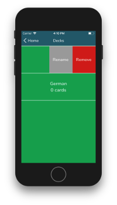

# Flashcards - Udacity React Nanodegree Project
Project based on react-native and redux technologies to demonstrate the knowledge gained through the React Nanodegree course offered by Udacity.

This project was bootstrapped with [Create React Native App](https://github.com/react-community/create-react-native-app).

The most recent version of this guide is available [here](https://github.com/react-community/create-react-native-app/blob/master/react-native-scripts/template/README.md).

Developed and tested only for **iOS** platform.

## How to install and run the project
Clone the repository through the following link: https://github.com/pedrodurek/mobile-flashcards-project

Open the terminal and run the following commands:
```bash
$ yarn
$ yarn start
# Or
$ npm install
$ npm start
```

## Screens





## Libraries and dependencies
* [react-native](https://github.com/facebook/react-native)
* [react](https://github.com/facebook/react)
* [create-react-native-app](https://github.com/react-community/create-react-native-app)
* [redux](https://github.com/reactjs/redux)
* [react-redux](https://github.com/reactjs/react-redux)
* [redux-thunk](https://github.com/gaearon/redux-thunk)
* [expo](https://github.com/expo/expo)
* [babel-plugin-module-resolver](https://github.com/tleunen/babel-plugin-module-resolver)
* [react-native-flip-card](https://github.com/moschan/react-native-flip-card)
* [react-native-keyboard-aware-scroll-view](https://github.com/APSL/react-native-keyboard-aware-scroll-view)
* [react-native-swipeable](https://github.com/jshanson7/react-native-swipeable)
* [react-navigation](https://github.com/react-navigation/react-navigation)
* [styled-components](https://github.com/styled-components/styled-components)
* [prop-types](https://github.com/facebook/prop-types)
* [uuid](https://github.com/kelektiv/node-uuid)